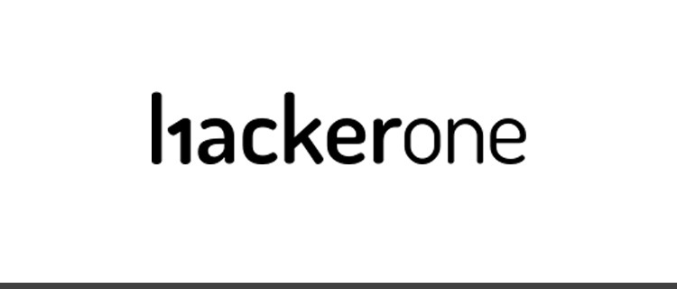
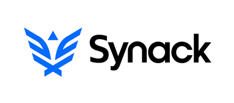

## CPH:SEC - A beginner's guide to bug bounties
##### v. 0.2 A

_Disclaimer & Caveat Lector: This article is for educational purposes only. The author is not responsible for any misuse or wrong doing. Always follow the law, whitehat hacking ethics and good business practice as well as industry standards._

+ By Martin Thirup @ CPH_SEC: http://hackerone.com/mthirup

### **Table of Contents**

1. #### [Introduction](#Introduction)
2. #### [List of bug bounty platforms and programs](The-list)
3. #### [How to get started](#How)
4. #### [TopicN](#TopicN)
5. #### [TopicN](#TopicN)
6. #### [Conclusion](#Conclusion)

### Introduction

This article is for people, who are looking for legal ways to use their pentesting skills to challenge themselves. There are multiple opportunities, depending on what you find exciting and your primary areas. This chapter will focus on web-hacking due to the fact that it is the most common scope at bug bounty programs. However, there are bug bounty programs for network hacking, mobile app hacking, iot hacking and more.

### List of Bug Bounty Platforms and Programs

First of all, it's important to keep track on all the bug bounty programs. Most of the programs are typically located at platforms like hackerone, bugcrowd, synack, cobalt, intigrity or others. However, some companies like Microsoft, AT&T, Apple, google, facebook and others prefer to run their programs without these platforms, so of course we will look into those later on in this guide aswell. Here's a short summary over the different bug bounty platforms.

#### Hackerone

[hackerone](https://hackerone.com/directory)

Hackerone is the biggest bug bounty platform in the world, which has a huge list of programs to be explored. The positive side of hackerone is that there are plenty of programs to try out, which makes it possible to grind on the platform, if you have the dedication for it. However, you are competing against 200.000+ other hackers in identifying the vulnerabilities first, and most programs start out as invite-only for some few people. As soon as you get your first points going, you will get invited to participate in programs before other people, but you will have a disadvantage, when you start. As soon as you have made some submissions, remember to mark your specialist skills set under your profile, as shown in the picture below. You need to have 3 submissions, that are worth showing off within a topic to have your primary skill approved by the hackerone staff, but do it as soon as you can to get invited to programs, that are more suitable for you.

[image](insert billede her.jpg) _[?] Billede mangler_

#### Synack

[Synack](https://hackerone.com/directory)

Synack is a closed platform, where you need to be approved for your skills, experience etc. to test for them. _[?] Har du ikke mere at sige om synack? For og imod de andre_

#### Bugcrowd, Cobalt and Intigrity:

Bugcrowd¹, Cobalt² and Intigrity³ are platforms that are very identical to hackerone, but just smaller. Bugcrowd, cobalt and intigrity also have public and invite-only programs, while some reward you in payments, others give kudos/hall of fame.

#### Surf:
+ ¹Bugcrowd: https://www.bugcrowd.com/
+ ²Cobalt: https://cobalt.io/ _[?] (er det korrekt link?)_
+ ³Intigrity: https://www.intigriti.com/public/

### How to get started

My best advice: Go for programs that give points, but don't pay cash in the beginning, just to get started and get some findings, while you may get invited to private programs sooner this way. ALWAYS read the rules of the programs through before you start testing. Some programs have an open scope for all the domains and subdomains, while others only cover a small scope of subdomains. There might also be rules about automated testing and other stuff that's worth noting.

### Conclusion

xxx _[?] Skriv et eller andet pis her :D_

#### Surf:
+ Bug Bounty Reference: https://github.com/ngalongc/bug-bounty-reference
+ Awesome Bug Bounty: https://github.com/djadmin/awesome-bug-bounty
